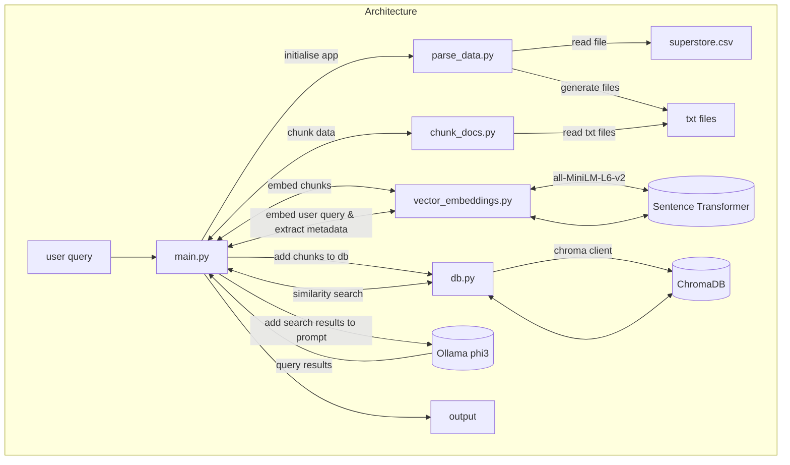

# RAG-Based Sales Data Analysis (under construction)
This is a course project for University of Helsinkis master level course 'Data Warehousing and Business Intelligence'. This project is a RAG system that uses a sales data set from Kaggle.
The app works by having s a integrated local LLM that answers users questions about sales, trends, patterns and insight. 

#### Components:
* `main.py` - main component connecting all other components. Works as a interface for user questions and LLM answers
* `parse_data.py` - transforms dataset from CSV file to meaningful strings
* `db.py` - adds data into chromedb
* `vector_embeddings.py` - calculates vector embeddings for strings using sentence-transformers

#### Architecture:

#### Technologies
* Backend: python, pandas, poetry (for dependency management)
* Vector database: Chromadb
* LLM: Ollama Phi-3 Mini
* Embeddings: sentence-transformers (all-MiniLM-L6-v2) 
* RAG framework: LangChain
* Dataset: [Superstore dataset](https://www.kaggle.com/datasets/vivek468/superstore-dataset-final)

